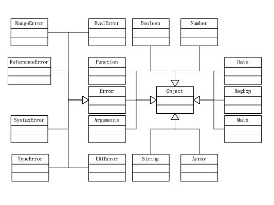

## END1、JavaScript API

### 0、全局函数与全局属性

> JavaScript的全局函数可参考C++全局函数的一个理解
> C++中有两种函数：全局函数和成员函数，二者区别如下
> 全局函数位于对象和类之外，成员函数（也称为成员方法）位于类内
>
> [菜鸟教程]: https://www.runoob.com/jsref/jsref-tutorial.html
> [CSDN]: https://blog.csdn.net/dalancon/article/details/7934688

**全局属性**

| 属性                                                         | 描述                     |
| :----------------------------------------------------------- | :----------------------- |
| [Infinity](https://www.runoob.com/jsref/jsref-infinity.html) | 代表正的无穷大的数值。   |
| [NaN](https://www.runoob.com/jsref/jsref-nan.html)           | 指示某个值是不是数字值。 |
| [undefined](https://www.runoob.com/jsref/jsref-undefined.html) | 指示未定义的值。         |

**全局函数**

| 函数                                                         | 描述                                               |
| :----------------------------------------------------------- | :------------------------------------------------- |
| [decodeURI()](https://www.runoob.com/jsref/jsref-decodeuri.html) | 解码某个编码的 URI。                               |
| [decodeURIComponent()](https://www.runoob.com/jsref/jsref-decodeuricomponent.html) | 解码一个编码的 URI 组件。                          |
| [encodeURI()](https://www.runoob.com/jsref/jsref-encodeuri.html) | 把字符串编码为 URI。                               |
| [encodeURIComponent()](https://www.runoob.com/jsref/jsref-encodeuricomponent.html) | 把字符串编码为 URI 组件。                          |
| [escape()](https://www.runoob.com/jsref/jsref-escape.html)   | 对字符串进行编码。                                 |
| [eval()](https://www.runoob.com/jsref/jsref-eval.html)       | 计算 JavaScript 字符串，并把它作为脚本代码来执行。 |
| [isFinite()](https://www.runoob.com/jsref/jsref-isfinite.html) | 检查某个值是否为有穷大的数。                       |
| [isNaN()](https://www.runoob.com/jsref/jsref-isnan.html)     | 检查某个值是否是数字。                             |
| [Number()](https://www.runoob.com/jsref/jsref-number.html)   | 把对象的值转换为数字。                             |
| [parseFloat()](https://www.runoob.com/jsref/jsref-parsefloat.html) | 解析一个字符串并返回一个浮点数。                   |
| [parseInt()](https://www.runoob.com/jsref/jsref-parseint.html) | 解析一个字符串并返回一个整数。                     |
| [String()](https://www.runoob.com/jsref/jsref-string.html)   | 把对象的值转换为字符串。                           |
| [unescape()](https://www.runoob.com/jsref/jsref-unescape.html) | 对由 escape() 编码的字符串进行解码。               |

### 1、js内置对象

> 独立于宿主环境 ECMAScript

 

#### Array 对象

**Array 对象属性**

| 属性                                                         | 描述                             |
| :----------------------------------------------------------- | :------------------------------- |
| [constructor](https://www.runoob.com/jsref/jsref-constructor-array.html) | 返回创建数组对象的原型函数。     |
| [length](https://www.runoob.com/jsref/jsref-length-array.html) | 设置或返回数组元素的个数。       |
| [prototype](https://www.runoob.com/jsref/jsref-prototype-array.html) | 允许你向数组对象添加属性或方法。 |

**Array 对象方法**

| 方法                                                         | 描述                                                 |
| :----------------------------------------------------------- | :--------------------------------------------------- |
| [concat()](https://www.runoob.com/jsref/jsref-concat-array.html) | 连接两个或更多的数组，并返回结果。                   |
| [copyWithin()](https://www.runoob.com/jsref/jsref-copywithin.html) | 从数组的指定位置拷贝元素到数组的另一个指定位置中。   |
| [entries()](https://www.runoob.com/jsref/jsref-entries.html) | 返回数组的可迭代对象。                               |
| [every()](https://www.runoob.com/jsref/jsref-every.html)     | 检测数值元素的每个元素是否都符合条件。               |
| [fill()](https://www.runoob.com/jsref/jsref-fill.html)       | 使用一个固定值来填充数组。                           |
| [filter()](https://www.runoob.com/jsref/jsref-filter.html)   | 检测数值元素，并返回符合条件所有元素的数组。         |
| [find()](https://www.runoob.com/jsref/jsref-find.html)       | 返回符合传入测试（函数）条件的数组元素。             |
| [findIndex()](https://www.runoob.com/jsref/jsref-findindex.html) | 返回符合传入测试（函数）条件的数组元素索引。         |
| [forEach()](https://www.runoob.com/jsref/jsref-foreach.html) | 数组每个元素都执行一次回调函数。                     |
| [from()](https://www.runoob.com/jsref/jsref-from.html)       | 通过给定的对象中创建一个数组。                       |
| [includes()](https://www.runoob.com/jsref/jsref-includes.html) | 判断一个数组是否包含一个指定的值。                   |
| [indexOf()](https://www.runoob.com/jsref/jsref-indexof-array.html) | 搜索数组中的元素，并返回它所在的位置。               |
| [isArray()](https://www.runoob.com/jsref/jsref-isarray.html) | 判断对象是否为数组。                                 |
| [join()](https://www.runoob.com/jsref/jsref-join.html)       | 把数组的所有元素放入一个字符串。                     |
| [keys()](https://www.runoob.com/jsref/jsref-keys.html)       | 返回数组的可迭代对象，包含原始数组的键(key)。        |
| [lastIndexOf()](https://www.runoob.com/jsref/jsref-lastindexof-array.html) | 搜索数组中的元素，并返回它最后出现的位置。           |
| [map()](https://www.runoob.com/jsref/jsref-map.html)         | 通过指定函数处理数组的每个元素，并返回处理后的数组。 |
| [pop()](https://www.runoob.com/jsref/jsref-pop.html)         | 删除数组的最后一个元素并返回删除的元素。             |
| [push()](https://www.runoob.com/jsref/jsref-push.html)       | 向数组的末尾添加一个或更多元素，并返回新的长度。     |
| [reduce()](https://www.runoob.com/jsref/jsref-reduce.html)   | 将数组元素计算为一个值（从左到右）。                 |
| [reduceRight()](https://www.runoob.com/jsref/jsref-reduceright.html) | 将数组元素计算为一个值（从右到左）。                 |
| [reverse()](https://www.runoob.com/jsref/jsref-reverse.html) | 反转数组的元素顺序。                                 |
| [shift()](https://www.runoob.com/jsref/jsref-shift.html)     | 删除并返回数组的第一个元素。                         |
| [slice()](https://www.runoob.com/jsref/jsref-slice-array.html) | 选取数组的一部分，并返回一个新数组。                 |
| [some()](https://www.runoob.com/jsref/jsref-some.html)       | 检测数组元素中是否有元素符合指定条件。               |
| [sort()](https://www.runoob.com/jsref/jsref-sort.html)       | 对数组的元素进行排序。                               |
| [splice()](https://www.runoob.com/jsref/jsref-splice.html)   | 从数组中添加或删除元素。                             |
| [toString()](https://www.runoob.com/jsref/jsref-tostring-array.html) | 把数组转换为字符串，并返回结果。                     |
| [unshift()](https://www.runoob.com/jsref/jsref-unshift.html) | 向数组的开头添加一个或更多元素，并返回新的长度。     |
| [valueOf()](https://www.runoob.com/jsref/jsref-valueof-array.html) | 返回数组对象的原始值。                               |

#### Boolean 对象

**Boolean 对象属性**

| 属性                                                         | 描述                                  |
| :----------------------------------------------------------- | :------------------------------------ |
| [constructor](https://www.runoob.com/jsref/jsref-constructor-boolean.html) | 返回对创建此对象的 Boolean 函数的引用 |
| [prototype](https://www.runoob.com/jsref/jsref-prototype-boolean.html) | 使您有能力向对象添加属性和方法。      |

**Boolean 对象方法**

| 方法                                                         | 描述                               |
| :----------------------------------------------------------- | :--------------------------------- |
| [toString()](https://www.runoob.com/jsref/jsref-tostring-boolean.html) | 把布尔值转换为字符串，并返回结果。 |
| [valueOf()](https://www.runoob.com/jsref/jsref-valueof-boolean.html) | 返回 Boolean 对象的原始值。        |

#### Date 对象

**Date 对象属性**

| 属性                                                         | 描述                                 |
| :----------------------------------------------------------- | :----------------------------------- |
| [constructor](https://www.runoob.com/jsref/jsref-constructor-date.html) | 返回对创建此对象的 Date 函数的引用。 |
| [prototype](https://www.runoob.com/jsref/jsref-prototype-date.html) | 使您有能力向对象添加属性和方法。     |

**Date 对象方法**

| 方法                                                         | 描述                                                         |
| :----------------------------------------------------------- | :----------------------------------------------------------- |
| [getDate()](https://www.runoob.com/jsref/jsref-getdate.html) | 从 Date 对象返回一个月中的某一天 (1 ~ 31)。                  |
| [getDay()](https://www.runoob.com/jsref/jsref-getday.html)   | 从 Date 对象返回一周中的某一天 (0 ~ 6)。                     |
| [getFullYear()](https://www.runoob.com/jsref/jsref-getfullyear.html) | 从 Date 对象以四位数字返回年份。                             |
| [getHours()](https://www.runoob.com/jsref/jsref-gethours.html) | 返回 Date 对象的小时 (0 ~ 23)。                              |
| [getMilliseconds()](https://www.runoob.com/jsref/jsref-getmilliseconds.html) | 返回 Date 对象的毫秒(0 ~ 999)。                              |
| [getMinutes()](https://www.runoob.com/jsref/jsref-getminutes.html) | 返回 Date 对象的分钟 (0 ~ 59)。                              |
| [getMonth()](https://www.runoob.com/jsref/jsref-getmonth.html) | 从 Date 对象返回月份 (0 ~ 11)。                              |
| [getSeconds()](https://www.runoob.com/jsref/jsref-getseconds.html) | 返回 Date 对象的秒数 (0 ~ 59)。                              |
| [getTime()](https://www.runoob.com/jsref/jsref-gettime.html) | 返回 1970 年 1 月 1 日至今的毫秒数。                         |
| [getTimezoneOffset()](https://www.runoob.com/jsref/jsref-gettimezoneoffset.html) | 返回本地时间与格林威治标准时间 (GMT) 的分钟差。              |
| [getUTCDate()](https://www.runoob.com/jsref/jsref-getutcdate.html) | 根据世界时从 Date 对象返回月中的一天 (1 ~ 31)。              |
| [getUTCDay()](https://www.runoob.com/jsref/jsref-getutcday.html) | 根据世界时从 Date 对象返回周中的一天 (0 ~ 6)。               |
| [getUTCFullYear()](https://www.runoob.com/jsref/jsref-getutcfullyear.html) | 根据世界时从 Date 对象返回四位数的年份。                     |
| [getUTCHours()](https://www.runoob.com/jsref/jsref-getutchours.html) | 根据世界时返回 Date 对象的小时 (0 ~ 23)。                    |
| [getUTCMilliseconds()](https://www.runoob.com/jsref/jsref-getutcmilliseconds.html) | 根据世界时返回 Date 对象的毫秒(0 ~ 999)。                    |
| [getUTCMinutes()](https://www.runoob.com/jsref/jsref-getutcminutes.html) | 根据世界时返回 Date 对象的分钟 (0 ~ 59)。                    |
| [getUTCMonth()](https://www.runoob.com/jsref/jsref-getutcmonth.html) | 根据世界时从 Date 对象返回月份 (0 ~ 11)。                    |
| [getUTCSeconds()](https://www.runoob.com/jsref/jsref-getutcseconds.html) | 根据世界时返回 Date 对象的秒钟 (0 ~ 59)。                    |
| getYear()                                                    | 已废弃。 请使用 getFullYear() 方法代替。                     |
| [parse()](https://www.runoob.com/jsref/jsref-parse.html)     | 返回1970年1月1日午夜到指定日期（字符串）的毫秒数。           |
| [setDate()](https://www.runoob.com/jsref/jsref-setdate.html) | 设置 Date 对象中月的某一天 (1 ~ 31)。                        |
| [setFullYear()](https://www.runoob.com/jsref/jsref-setfullyear.html) | 设置 Date 对象中的年份（四位数字）。                         |
| [setHours()](https://www.runoob.com/jsref/jsref-sethours.html) | 设置 Date 对象中的小时 (0 ~ 23)。                            |
| [setMilliseconds()](https://www.runoob.com/jsref/jsref-setmilliseconds.html) | 设置 Date 对象中的毫秒 (0 ~ 999)。                           |
| [setMinutes()](https://www.runoob.com/jsref/jsref-setminutes.html) | 设置 Date 对象中的分钟 (0 ~ 59)。                            |
| [setMonth()](https://www.runoob.com/jsref/jsref-setmonth.html) | 设置 Date 对象中月份 (0 ~ 11)。                              |
| [setSeconds()](https://www.runoob.com/jsref/jsref-setseconds.html) | 设置 Date 对象中的秒钟 (0 ~ 59)。                            |
| [setTime()](https://www.runoob.com/jsref/jsref-settime.html) | setTime() 方法以毫秒设置 Date 对象。                         |
| [setUTCDate()](https://www.runoob.com/jsref/jsref-setutcdate.html) | 根据世界时设置 Date 对象中月份的一天 (1 ~ 31)。              |
| [setUTCFullYear()](https://www.runoob.com/jsref/jsref-setutcfullyear.html) | 根据世界时设置 Date 对象中的年份（四位数字）。               |
| [setUTCHours()](https://www.runoob.com/jsref/jsref-setutchours.html) | 根据世界时设置 Date 对象中的小时 (0 ~ 23)。                  |
| [setUTCMilliseconds()](https://www.runoob.com/jsref/jsref-setutcmilliseconds.html) | 根据世界时设置 Date 对象中的毫秒 (0 ~ 999)。                 |
| [setUTCMinutes()](https://www.runoob.com/jsref/jsref-setutcminutes.html) | 根据世界时设置 Date 对象中的分钟 (0 ~ 59)。                  |
| [setUTCMonth()](https://www.runoob.com/jsref/jsref-setutcmonth.html) | 根据世界时设置 Date 对象中的月份 (0 ~ 11)。                  |
| [setUTCSeconds()](https://www.runoob.com/jsref/jsref-setutcseconds.html) | setUTCSeconds() 方法用于根据世界时 (UTC) 设置指定时间的秒字段。 |
| setYear()                                                    | 已废弃。请使用 setFullYear() 方法代替。                      |
| [toDateString()](https://www.runoob.com/jsref/jsref-todatestring.html) | 把 Date 对象的日期部分转换为字符串。                         |
| toGMTString()                                                | 已废弃。请使用 toUTCString() 方法代替。                      |
| [toISOString()](https://www.runoob.com/jsref/jsref-toisostring.html) | 使用 ISO 标准返回字符串的日期格式。                          |
| [toJSON()](https://www.runoob.com/jsref/jsref-tojson.html)   | 以 JSON 数据格式返回日期字符串。                             |
| [toLocaleDateString()](https://www.runoob.com/jsref/jsref-tolocaledatestring.html) | 根据本地时间格式，把 Date 对象的日期部分转换为字符串。       |
| [toLocaleTimeString()](https://www.runoob.com/jsref/jsref-tolocaletimestring.html) | 根据本地时间格式，把 Date 对象的时间部分转换为字符串。       |
| [toLocaleString()](https://www.runoob.com/jsref/jsref-tolocalestring.html) | 根据本地时间格式，把 Date 对象转换为字符串。                 |
| [toString()](https://www.runoob.com/jsref/jsref-tostring-date.html) | 把 Date 对象转换为字符串。                                   |
| [toTimeString()](https://www.runoob.com/jsref/jsref-totimestring.html) | 把 Date 对象的时间部分转换为字符串。                         |
| [toUTCString()](https://www.runoob.com/jsref/jsref-toutcstring.html) | 根据世界时，把 Date 对象转换为字符串。实例：`var today = new Date(); var UTCstring = today.toUTCString();` |
| [UTC()](https://www.runoob.com/jsref/jsref-utc.html)         | 根据世界时返回 1970 年 1 月 1 日 到指定日期的毫秒数。        |
| [valueOf()](https://www.runoob.com/jsref/jsref-valueof-date.html) | 返回 Date 对象的原始值。                                     |

#### Math 对象

>Math 对象没有构造函数 Math()

**Math 对象属性**

| 属性                                                       | 描述                                                    |
| :--------------------------------------------------------- | :------------------------------------------------------ |
| [E](https://www.runoob.com/jsref/jsref-e.html)             | 返回算术常量 e，即自然对数的底数（约等于2.718）。       |
| [LN2](https://www.runoob.com/jsref/jsref-ln2.html)         | 返回 2 的自然对数（约等于0.693）。                      |
| [LN10](https://www.runoob.com/jsref/jsref-ln10.html)       | 返回 10 的自然对数（约等于2.302）。                     |
| [LOG2E](https://www.runoob.com/jsref/jsref-log2e.html)     | 返回以 2 为底的 e 的对数（约等于 1.4426950408889634）。 |
| [LOG10E](https://www.runoob.com/jsref/jsref-log10e.html)   | 返回以 10 为底的 e 的对数（约等于0.434）。              |
| [PI](https://www.runoob.com/jsref/jsref-pi.html)           | 返回圆周率（约等于3.14159）。                           |
| [SQRT1_2](https://www.runoob.com/jsref/jsref-sqrt1-2.html) | 返回 2 的平方根的倒数（约等于 0.707）。                 |
| [SQRT2](https://www.runoob.com/jsref/jsref-sqrt2.html)     | 返回 2 的平方根（约等于 1.414）。                       |

**Math 对象方法**

| 方法                                                         | 描述                                                         |
| :----------------------------------------------------------- | :----------------------------------------------------------- |
| [abs(x)](https://www.runoob.com/jsref/jsref-abs.html)        | 返回 x 的绝对值。                                            |
| [acos(x)](https://www.runoob.com/jsref/jsref-acos.html)      | 返回 x 的反余弦值。                                          |
| [asin(x)](https://www.runoob.com/jsref/jsref-asin.html)      | 返回 x 的反正弦值。                                          |
| [atan(x)](https://www.runoob.com/jsref/jsref-atan.html)      | 以介于 -PI/2 与 PI/2 弧度之间的数值来返回 x 的反正切值。     |
| [atan2(y,x)](https://www.runoob.com/jsref/jsref-atan2.html)  | 返回从 x 轴到点 (x,y) 的角度（介于 -PI/2 与 PI/2 弧度之间）。 |
| [ceil(x)](https://www.runoob.com/jsref/jsref-ceil.html)      | 对数进行上舍入。                                             |
| [cos(x)](https://www.runoob.com/jsref/jsref-cos.html)        | 返回数的余弦。                                               |
| [exp(x)](https://www.runoob.com/jsref/jsref-exp.html)        | 返回 Ex 的指数。                                             |
| [floor(x)](https://www.runoob.com/jsref/jsref-floor.html)    | 对 x 进行下舍入。                                            |
| [log(x)](https://www.runoob.com/jsref/jsref-log.html)        | 返回数的自然对数（底为e）。                                  |
| [max(x,y,z,...,n)](https://www.runoob.com/jsref/jsref-max.html) | 返回 x,y,z,...,n 中的最高值。                                |
| [min(x,y,z,...,n)](https://www.runoob.com/jsref/jsref-min.html) | 返回 x,y,z,...,n中的最低值。                                 |
| [pow(x,y)](https://www.runoob.com/jsref/jsref-pow.html)      | 返回 x 的 y 次幂。                                           |
| [random()](https://www.runoob.com/jsref/jsref-random.html)   | 返回 0 ~ 1 之间的随机数。                                    |
| [round(x)](https://www.runoob.com/jsref/jsref-round.html)    | 四舍五入。                                                   |
| [sin(x)](https://www.runoob.com/jsref/jsref-sin.html)        | 返回数的正弦。                                               |
| [sqrt(x)](https://www.runoob.com/jsref/jsref-sqrt.html)      | 返回数的平方根。                                             |
| [tan(x)](https://www.runoob.com/jsref/jsref-tan.html)        | 返回角的正切。                                               |

#### Number 对象

> Number 对象是原始数值的包装对象

**Number 对象属性**

| 属性                                                         | 描述                                   |
| :----------------------------------------------------------- | :------------------------------------- |
| [constructor](https://www.runoob.com/jsref/jsref-constructor-number.html) | 返回对创建此对象的 Number 函数的引用。 |
| [MAX_VALUE](https://www.runoob.com/jsref/jsref-max-value.html) | 可表示的最大的数。                     |
| [MIN_VALUE](https://www.runoob.com/jsref/jsref-min-value.html) | 可表示的最小的数。                     |
| [NEGATIVE_INFINITY](https://www.runoob.com/jsref/jsref-negative-infinity.html) | 负无穷大，溢出时返回该值。             |
| [NaN](https://www.runoob.com/jsref/jsref-number-nan.html)    | 非数字值。                             |
| [POSITIVE_INFINITY](https://www.runoob.com/jsref/jsref-positive-infinity.html) | 正无穷大，溢出时返回该值。             |
| [prototype](https://www.runoob.com/jsref/jsref-prototype-num.html) | 允许您可以向对象添加属性和方法。       |

**Number 对象方法**

| 方法                                                         | 描述                                                 |
| :----------------------------------------------------------- | :--------------------------------------------------- |
| [isFinite](https://www.runoob.com/jsref/jsref-isfinite-number.html) | 检测指定参数是否为无穷大。                           |
| [isInteger](https://www.runoob.com/jsref/jsref-isinteger-number.html) | 检测指定参数是否为整数。                             |
| [isNaN](https://www.runoob.com/jsref/jsref-isnan-number.html) | 检测指定参数是否为 NaN。                             |
| [isSafeInteger](https://www.runoob.com/jsref/jsref-issafeInteger-number.html) | 检测指定参数是否为安全整数。                         |
| [toExponential(x)](https://www.runoob.com/jsref/jsref-toexponential.html) | 把对象的值转换为指数计数法。                         |
| [toFixed(x)](https://www.runoob.com/jsref/jsref-tofixed.html) | 把数字转换为字符串，结果的小数点后有指定位数的数字。 |
| [toLocaleString(locales, options)](https://www.runoob.com/jsref/jsref-tolocalestring-number.html) | 返回数字在特定语言环境下的表示字符串。               |
| [toPrecision(x)](https://www.runoob.com/jsref/jsref-toprecision.html) | 把数字格式化为指定的长度。                           |
| [toString()](https://www.runoob.com/jsref/jsref-tostring-number.html) | 把数字转换为字符串，使用指定的基数。                 |
| [valueOf()](https://www.runoob.com/jsref/jsref-valueof-number.html) | 返回一个 Number 对象的基本数字值。                   |

#### String 对象

**String 对象属性**

| 属性                                                         | 描述                       |
| :----------------------------------------------------------- | :------------------------- |
| [constructor](https://www.runoob.com/jsref/jsref-constructor-string.html) | 对创建该对象的函数的引用   |
| [length](https://www.runoob.com/jsref/jsref-length-string.html) | 字符串的长度               |
| [prototype](https://www.runoob.com/jsref/jsref-prototype-string.html) | 允许您向对象添加属性和方法 |

**String 对象方法**

| 方法                                                         | 描述                                                         |
| :----------------------------------------------------------- | :----------------------------------------------------------- |
| [charAt()](https://www.runoob.com/jsref/jsref-charat.html)   | 返回在指定位置的字符。                                       |
| [charCodeAt()](https://www.runoob.com/jsref/jsref-charcodeat.html) | 返回在指定的位置的字符的 Unicode 编码。                      |
| [concat()](https://www.runoob.com/jsref/jsref-concat-string.html) | 连接两个或更多字符串，并返回新的字符串。                     |
| [endsWith()](https://www.runoob.com/jsref/jsref-endswith.html) | 判断当前字符串是否是以指定的子字符串结尾的（区分大小写）。   |
| [fromCharCode()](https://www.runoob.com/jsref/jsref-fromcharcode.html) | 将 Unicode 编码转为字符。                                    |
| [indexOf()](https://www.runoob.com/jsref/jsref-indexof.html) | 返回某个指定的字符串值在字符串中首次出现的位置。             |
| [includes()](https://www.runoob.com/jsref/jsref-string-includes.html) | 查找字符串中是否包含指定的子字符串。                         |
| [lastIndexOf()](https://www.runoob.com/jsref/jsref-lastindexof.html) | 从后向前搜索字符串，并从起始位置（0）开始计算返回字符串最后出现的位置。 |
| [match()](https://www.runoob.com/jsref/jsref-match.html)     | 查找找到一个或多个正则表达式的匹配。                         |
| [repeat()](https://www.runoob.com/jsref/jsref-repeat.html)   | 复制字符串指定次数，并将它们连接在一起返回。                 |
| [replace()](https://www.runoob.com/jsref/jsref-replace.html) | 在字符串中查找匹配的子串，并替换与正则表达式匹配的子串。     |
| [replaceAll()](https://www.runoob.com/jsref/jsref-replaceall.html) | 在字符串中查找匹配的子串，并替换与正则表达式匹配的所有子串。 |
| [search()](https://www.runoob.com/jsref/jsref-search.html)   | 查找与正则表达式相匹配的值。                                 |
| [slice()](https://www.runoob.com/jsref/jsref-slice-string.html) | 提取字符串的片断，并在新的字符串中返回被提取的部分。         |
| [split()](https://www.runoob.com/jsref/jsref-split.html)     | 把字符串分割为字符串数组。                                   |
| [startsWith()](https://www.runoob.com/jsref/jsref-startswith.html) | 查看字符串是否以指定的子字符串开头。                         |
| [substr()](https://www.runoob.com/jsref/jsref-substr.html)   | 从起始索引号提取字符串中指定数目的字符。                     |
| [substring()](https://www.runoob.com/jsref/jsref-substring.html) | 提取字符串中两个指定的索引号之间的字符。                     |
| [toLowerCase()](https://www.runoob.com/jsref/jsref-tolowercase.html) | 把字符串转换为小写。                                         |
| [toUpperCase()](https://www.runoob.com/jsref/jsref-touppercase.html) | 把字符串转换为大写。                                         |
| [trim()](https://www.runoob.com/jsref/jsref-trim.html)       | 去除字符串两边的空白。                                       |
| [toLocaleLowerCase()](https://www.runoob.com/jsref/jsref-tolocalelowercase.html) | 根据本地主机的语言环境把字符串转换为小写。                   |
| [toLocaleUpperCase()](https://www.runoob.com/jsref/jsref-tolocaleuppercase.html) | 根据本地主机的语言环境把字符串转换为大写。                   |
| [valueOf()](https://www.runoob.com/jsref/jsref-valueof-string.html) | 返回某个字符串对象的原始值。                                 |
| [toString()](https://www.runoob.com/jsref/jsref-tostring.html) | 返回一个字符串。                                             |

#### RegExp 对象

**RegExp 对象属性**

| 属性                                                         | 描述                                               |
| :----------------------------------------------------------- | :------------------------------------------------- |
| [constructor](https://www.runoob.com/jsref/jsref-regexp-constructor.html) | 返回一个函数，该函数是一个创建 RegExp 对象的原型。 |
| [global](https://www.runoob.com/jsref/jsref-regexp-global.html) | 判断是否设置了 "g" 修饰符                          |
| [ignoreCase](https://www.runoob.com/jsref/jsref-regexp-ignorecase.html) | 判断是否设置了 "i" 修饰符                          |
| [lastIndex](https://www.runoob.com/jsref/jsref-lastindex-regexp.html) | 用于规定下次匹配的起始位置                         |
| [multiline](https://www.runoob.com/jsref/jsref-multiline-regexp.html) | 判断是否设置了 "m" 修饰符                          |
| [source](https://www.runoob.com/jsref/jsref-source-regexp.html) | 返回正则表达式的匹配模式                           |

**RegExp 对象方法**

| 方法                                                         | 描述                                               |
| :----------------------------------------------------------- | :------------------------------------------------- |
| [compile](https://www.runoob.com/jsref/jsref-regexp-compile.html) | 在 1.5 版本中已废弃。 编译正则表达式。             |
| [exec](https://www.runoob.com/jsref/jsref-exec-regexp.html)  | 检索字符串中指定的值。返回找到的值，并确定其位置。 |
| [test](https://www.runoob.com/jsref/jsref-test-regexp.html)  | 检索字符串中指定的值。返回 true 或 false。         |
| [toString](https://www.runoob.com/jsref/jsref-regexp-tostring.html) | 返回正则表达式的字符串。                           |

#### Arguments对象

> 当我们在js中在调用一个函数的时候，我们经常会给这个函数传递一些参数，js把传入到这个函数的全部参数存储在一个叫做arguments的东西里面

| 属性   | 描述                       |
| ------ | -------------------------- |
| callee | 对当前正在执行函数的引用。 |
| length | 传递给函数的实际参数个数。 |

#### Object对象

> 所有对象的祖先

| 属性/方法              | 描述                                                     |
| ---------------------- | -------------------------------------------------------- |
| constructor 属性       | 对一个Javascript函数的引用,该函数是对象的构造函数。      |
| hasOwnProperty()       | 检查对象是否有局部定义的(非继承的)、具有特定名字的属性。 |
| isPrototypeOf()        | 检查对象是否是指定对象的原型。                           |
| propertyIsEnumerable() | 检查指定的属性是否存在,以及是否能用for/in循环枚举。      |
| toLocaleString()       | 返回对象地方化的字符串表示。                             |
| toString()             | 返回对象的字符串表示。                                   |
| valueOf()              | 返回对象的原始值(如果存在)。                             |

#### Error对象

> 即异常对象
>
> 子对象类型，指示具体的错误类型。
>
> - EvalError(执行错误)。
> - RangeError(在数字超出合法范围时抛出)。
> - ReferenceError(在读取不存在的变量时抛出)。
> - SyntaxError(抛出该错误用来通知语法错)。
> - TypeError(当一个值的类型错误时,抛出该异常)。
> - URIError(由URI的编码和解码方法抛出)。

| 属性/方法  | 描述                            |
| ---------- | ------------------------------- |
| message    | 提供异常详细信息的错误消息。    |
| name       | 声名异常类型的字符串。          |
| toString() | 返回一个表示Error对象的字符串。 |

#### Function对象

| 属性/方法  | 描述                                                         |
| ---------- | ------------------------------------------------------------ |
| arguments  | Arguments对象, 反对使用该属性。                              |
| caller     | 对调用当前函数的Funciton对象的引用,反对使用该属性。          |
| length     | 在声名函数时指定的命名参数个数。                             |
| prototype  | 一个对象,用于构造函数,这个对象定义的属性和方法由构造函数创建的所有对象共享。 |
| apply()    | 将函数作为指定对象的方法来调用,传递给它的是指定的参数数组。  |
| call()     | 将函数作为指定对象的方法来调用,传递给它的是指定的参数。      |
| toString() | 返回函数的字符串表示。                                       |